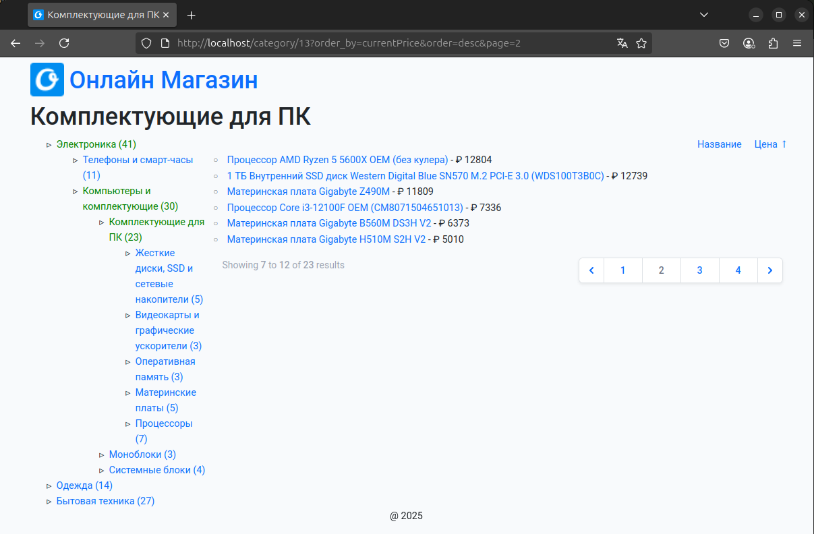

# Demo Online Shop
This is small experiment with Laravel & Bootstrap 5 & Sail.



## How to deploy locally

* clone and install dependencies
```bash
$ git clone ...
$ cd online-shop
$ composer install
$ mv .env.local .env
$ php artisan key:generate
$ ./vendor/bin/sail build --no-cache
```
* run backend
```bash
$ ./vendor/bin/sail up
```
* in another terminal tab run frontend
```bash
$ npm i
$ npm run dev
```
* go to http://0.0.0.0
* in case of 'No Application Encryption Key Has Been Specified':
```bash
$ ./vendor/bin/sail artisan key:generate
$ ./vendor/bin/sail artisan config:cache
```